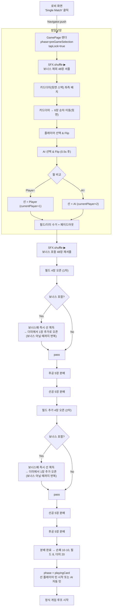

# 고스톱 싱글매치 전체 플로우 다이어그램

## Mermaid 다이어그램

## 주요 특징

### 1. 밤일낮장 (선 결정)
- 48장 셔플 (보너스 제외)
- 6장 뒷면 배치
- 플레이어/AI 순차 선택
- 월 비교로 선 결정

### 2. 정식 분배 규칙
- **1차**: 필드 4장 오픈 → 후공 5장 → 선공 5장
- **2차**: 필드 추가 4장 오픈 → 선공 5장 → 후공 5장
- **결과**: 손패 10·10, 필드 8, 더미 20

### 3. 보너스패 처리
- 필드에 보너스패 깔리면 즉시 선 플레이어 획득
- 더미에서 1장 추가로 오픈 (보너스 아닐 때까지 반복)
- 1차/2차 필드 오픈 시 모두 적용

### 4. 상태 관리
- `phase`: preGameSelection → playingCard
- `tapLock`: 입력 제어
- `currentPlayer`: 선 플레이어 설정

### 5. 애니메이션 & 사운드
- SFX.shuffle: 셔플 효과음
- SFX.cardDeal: 카드 분배 효과음
- SFX.cardFlip: 카드 뒤집기 효과음
- 순차 애니메이션: 0.1s 간격

## 구현 시 주의사항

1. **보너스패 반복 처리**: 필드 오픈 시 보너스가 아닐 때까지 계속 더미에서 카드를 가져와야 함
2. **선/후공 순서**: 분배 순서가 선공/후공에 따라 달라짐
3. **상태 전환**: preGameSelection → playingCard 전환 시점 명확히
4. **애니메이션 타이밍**: 각 단계별 적절한 딜레이 설정
5. **예외 처리**: 카드 소진 시나리오 고려

---
*생성일: 2024년 12월*
*버전: 1.0* 